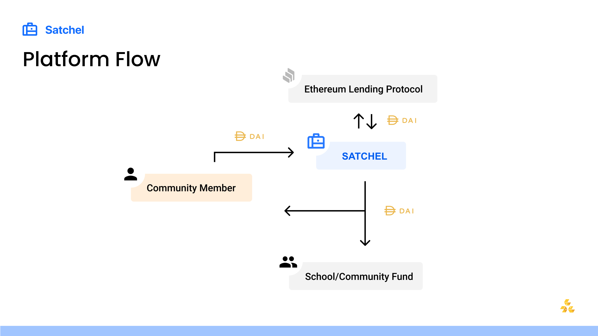

# Satchel

## Table of Contents

1. [Description](#Description)
2. [Features](#Features)
3. [Setup](#Setup)
4. [Demo](#Demo)
5. [License](#License)

## Description

Satchel is a mobile-optimized web application that leverages a crowdfunding framework to bank underbanked communities that may lack access to stable financial climates, but have access to the internet. Satchel combats hyperinflation and economic distrust by giving users banking functionality with the use of DAI, a cryptocurrency soft-pegged to the U.S. dollar. Satchel allows users to invest in both themselves and their local school, which operates as an economic hub for each community. By arming communities with the tools they need to adopt socioeconomic mobility at the individual and communal level, Satchel can redefine financial autonomy on the global scale.

### Technical Architecture

- React.js and web3 for the frontend
- Compound as the the Ethereum-lending protocol to garner interest for users
- Solidity for smart contracts
- MetaMask for authentication

### Visualization of Primary Flow



## Features

### Current Features

Satchel currently has two user flows: That of the school and that of the community member.

#### User

- User can sign up and login with their MetaMask account.
- User can choose which school they are associated with.
- User can deposit DAI from their personal wallet into Satchel such that it can garner interest over time.
- User can withdraw DAI from their savings account in Satchel, at which point the garnered interest will be evenly split between the user and their associated school.
- User can see the current interest rate of Satchel on their Dashboard, which is updated upon withdrawals.
- User can see the exact amount of DAI they have contributed to their local school.
- User can see the name of their local school.
- User can see the projects that their school is currently running and utilizing their contributions for.

#### School

- Multiple schools can sign up and login with their MetaMask accounts.
- School can withdraw DAI that has been sent to the school from the garnered interest of its associated community members. Withdrawn funds go to the school’s wallet.
- School can create a new project that will be showcased to its community members.
- School can see current projects.

### Future Features

We plan to add the following improvements:

- User can take out loans from Satchel and redeem those loans.
- User maintains a credit rating that implicates their loan flexibility and is impacted by loan redemption timeliness.
- Add a flow for a non-community-member to be able to interact with Satchel and contribute to a school in a developing region.
- School projects are created with real data.
- Implement governance such that users can vote on which school projects are prioritized funding-wise.

## Setup

App will be running at [http://localhost:3000/](http://localhost:3000/) and use the Goerli testnet for testing purposes.

### 1. Prerequisites

Please ensure that you have the following installed on your computer:

- Node JS
- Node Package Manager (npm) or Yarn
- Truffle
- Hardhat

### 2. Clone the repo

### 3. Set up dependencies

```
cd client
npm install
cd ../blockchain
npm install
cd ../server
npm install
```

### 4. Get Goerli test DAI from Compound

Instructions: https://teller.gitbook.io/teller-1/testing-guide/getting-testnet-tokens-ropsten-1#dai-through-compound, except connect to Goerli instead of Ropsten
Compound: https://app.compound.finance/

### 5. Fill out the smart-contract side .env

```
ARCHIVE_MAINNET_NODE_URL=
MNEMONIC=
ARCHIVE_GOERLI_NODE_URL=
GOERLI_PRIVATE_KEY=
```

### 6. Deploy the smart contracts


```
cd blockchain
yarn deploy
```

### 7. Fill out the server side .env

```
PORT=4000
MONGOOSE=[YOUR MONGO DB URL]
```

### 8. Fill out the client side .env

```
REACT_APP_CONTRACT_ADDRESS=[THE ADDRESS OF THE CONTRACT DEPLOYED IN STEP 6]
REACT_APP_TOKEN_ADDRESS=0xdc31Ee1784292379Fbb2964b3B9C4124D8F89C60
REACT_APP_CTOKEN_ADDRESS=0x822397d9a55d0fefd20f5c4bcab33c5f65bd28eb
```

### 9. Start the server

```
cd server
npm start
```

### 10. Start the frontend

```
cd client
npm start
```

## Demo

### Video Demo

[](https://youtu.be/2gGPDbgQIrY)

### Figma Prototype Demo

Our [figma prototype](https://www.figma.com/proto/MQRABZHxaGFJSBRdOBX6xf/UNICEF?node-id=729%3A7067&scaling=min-zoom) showcases the envisioned functionality of Satchel after future features are included.

### 2021 Update Demo

[](https://drive.google.com/file/d/1ni5Ra_krcwS4znjZATNK6V8UEa88BWsm/preview)

## License

    Copyright 2020 Blockchain at Berkeley

    Licensed under the Apache License, Version 2.0 (the "License");
    you may not use this file except in compliance with the License.
    You may obtain a copy of the License at

        http://www.apache.org/licenses/LICENSE-2.0

    Unless required by applicable law or agreed to in writing, software
    distributed under the License is distributed on an "AS IS" BASIS,
    WITHOUT WARRANTIES OR CONDITIONS OF ANY KIND, either express or implied.
    See the License for the specific language governing permissions and
    limitations under the License.
